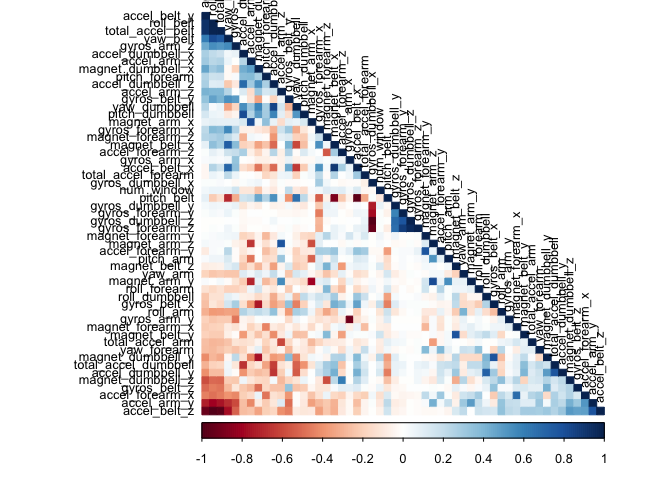

Prediction Assignment Writeup
=============================

I. Overview
-----------

This project looks to predict the manner in which 6 participants
performed some exercise as described below. This is the “classe”
variable in the training set. The machine learning algorithm is applied
to the 20 test cases available in the test data. The report is the final
part of the Coursera’s course Practical Machine Learning.

II. Background
--------------

Using devices such as Jawbone Up, Nike FuelBand, and Fitbit it is now
possible to collect a large amount of data about personal activity
relatively inexpensively. These type of devices are part of the
quantified self movement – a group of enthusiasts who take measurements
about themselves regularly to improve their health, to find patterns in
their behavior, or because they are tech geeks. One thing that people
regularly do is quantify how much of a particular activity they do, but
they rarely quantify how well they do it. In this project, your goal
will be to use data from accelerometers on the belt, forearm, arm, and
dumbell of 6 participants. They were asked to perform barbell lifts
correctly and incorrectly in 5 different ways. More information is
available from the website here:
<a href="http://groupware.les.inf.puc-rio.br/har" class="uri">http://groupware.les.inf.puc-rio.br/har</a>
(see the section on the Weight Lifting Exercise Dataset).

III. Data Loading and Exploratory Analysis
------------------------------------------

### III.a Overview

The training data for this project are available here:

<a href="https://d396qusza40orc.cloudfront.net/predmachlearn/pml-training.csv" class="uri">https://d396qusza40orc.cloudfront.net/predmachlearn/pml-training.csv</a>

The test data are available here:

<a href="https://d396qusza40orc.cloudfront.net/predmachlearn/pml-testing.csv" class="uri">https://d396qusza40orc.cloudfront.net/predmachlearn/pml-testing.csv</a>

### III.b Enviroment

    rm(list=ls()) 
    setwd("~/Documents/Trabajo/Telmex/Coursera/Practical Machine Learning")
    library(knitr)
    library(caret)
    library(rpart)
    library(rpart.plot)
    library(rattle)
    library(randomForest)
    library(corrplot)
    set.seed(1)

### III.c Data Loading and Cleaning

Data is loading fron the url and the training dataset is partinioned to
create a Training set (70% of the data) for the modeling process and a
Test set (with the remaining 30%) for the validations.

    # download the datasets
    training <- read.csv(url("https://d396qusza40orc.cloudfront.net/predmachlearn/pml-training.csv"))
    testing  <- read.csv(url("https://d396qusza40orc.cloudfront.net/predmachlearn/pml-testing.csv"))

    # create a partition with the training dataset 
    inTrain  <- createDataPartition(training$classe, p=0.7, list=FALSE)
    TrainSet <- training[inTrain, ]
    TestSet  <- training[-inTrain, ]
    dim(TrainSet)

    ## [1] 13737   160

    dim(TestSet)

    ## [1] 5885  160

    # remove columns that contain NA missing values
    TrainSet <- TrainSet[, colSums(is.na(TrainSet)) == 0] 
    TestSet <- TestSet[, colSums(is.na(TestSet)) == 0] 

    # remove variables with Nearly Zero Variance
    NZV <- nearZeroVar(TrainSet)
    TrainSet <- TrainSet[, -NZV]
    TestSet  <- TestSet[, -NZV]

    # remove identification only variables (columns 1 to 5)
    TrainSet <- TrainSet[, -(1:5)]
    TestSet  <- TestSet[, -(1:5)]
    dim(TrainSet)

    ## [1] 13737    54

    dim(TestSet)

    ## [1] 5885   54

    # classe colum as factor
    TestSet$classe <- as.factor(TestSet$classe)

With the cleaning process above, the number of variables for the
analysis has been reduced to 54 only.

### III.d Correlation Analysis

A correlation among variables is analysed before proceeding to the
modeling procedures.

    corMatrix <- cor(TrainSet[, -54])
    corrplot(corMatrix, order = "FPC", method = "color", type = "lower", tl.cex = 0.8, tl.col = rgb(0, 0, 0))

IV. Prediction Model Building
-----------------------------

Three methods will be applied to model the regressions (in the Train
dataset) and the best one (with higher accuracy when applied to the Test
dataset) will be used for the quiz predictions. The methods are: Random
Forests, Decision Tree and Generalized Boosted Model, as described
below. A Confusion Matrix is plotted at the end of each analysis to
better visualize the accuracy of the models.

### IV.a Random Forest

    # model fit
    controlRF <- trainControl(method="cv", number=3, verboseIter=FALSE)
    modFitRandForest <- train(classe ~ ., data=TrainSet, method="rf", trControl=controlRF)
    modFitRandForest$finalModel

    ## 
    ## Call:
    ##  randomForest(x = x, y = y, mtry = param$mtry) 
    ##                Type of random forest: classification
    ##                      Number of trees: 500
    ## No. of variables tried at each split: 27
    ## 
    ##         OOB estimate of  error rate: 0.23%
    ## Confusion matrix:
    ##      A    B    C    D    E  class.error
    ## A 3905    0    0    0    1 0.0002560164
    ## B    8 2648    2    0    0 0.0037622272
    ## C    0    7 2388    1    0 0.0033388982
    ## D    0    0    9 2243    0 0.0039964476
    ## E    0    2    0    2 2521 0.0015841584

    plot(modFitRandForest)

    # prediction on Test dataset
    predictRandForest <- predict(modFitRandForest, newdata=TestSet)
    confMatRandForest <- confusionMatrix(predictRandForest, TestSet$classe)
    confMatRandForest

    ## Confusion Matrix and Statistics
    ## 
    ##           Reference
    ## Prediction    A    B    C    D    E
    ##          A 1673    2    0    0    0
    ##          B    1 1136    2    0    0
    ##          C    0    0 1018    1    0
    ##          D    0    1    6  962    1
    ##          E    0    0    0    1 1081
    ## 
    ## Overall Statistics
    ##                                           
    ##                Accuracy : 0.9975          
    ##                  95% CI : (0.9958, 0.9986)
    ##     No Information Rate : 0.2845          
    ##     P-Value [Acc > NIR] : < 2.2e-16       
    ##                                           
    ##                   Kappa : 0.9968          
    ##                                           
    ##  Mcnemar's Test P-Value : NA              
    ## 
    ## Statistics by Class:
    ## 
    ##                      Class: A Class: B Class: C Class: D Class: E
    ## Sensitivity            0.9994   0.9974   0.9922   0.9979   0.9991
    ## Specificity            0.9995   0.9994   0.9998   0.9984   0.9998
    ## Pos Pred Value         0.9988   0.9974   0.9990   0.9918   0.9991
    ## Neg Pred Value         0.9998   0.9994   0.9984   0.9996   0.9998
    ## Prevalence             0.2845   0.1935   0.1743   0.1638   0.1839
    ## Detection Rate         0.2843   0.1930   0.1730   0.1635   0.1837
    ## Detection Prevalence   0.2846   0.1935   0.1732   0.1648   0.1839
    ## Balanced Accuracy      0.9995   0.9984   0.9960   0.9981   0.9994

    # plot model and matrix results
    plot(confMatRandForest$table, col = confMatRandForest$byClass, main = paste("Random Forest - Accuracy =", round(confMatRandForest$overall['Accuracy'], 4)))

### IV.b Decision Trees

    # model fit
    modFitDecTree <- rpart(classe ~ ., data=TrainSet, method="class")
    fancyRpartPlot(modFitDecTree)

    # prediction on Test dataset
    predictDecTree <- predict(modFitDecTree, newdata=TestSet, type="class")
    confMatDecTree <- confusionMatrix(predictDecTree, TestSet$classe)
    confMatDecTree

    ## Confusion Matrix and Statistics
    ## 
    ##           Reference
    ## Prediction    A    B    C    D    E
    ##          A 1511  270   43   93   78
    ##          B   27  528   30   13   73
    ##          C   29  107  843   99   68
    ##          D   96  136   72  688  166
    ##          E   11   98   38   71  697
    ## 
    ## Overall Statistics
    ##                                           
    ##                Accuracy : 0.7251          
    ##                  95% CI : (0.7135, 0.7364)
    ##     No Information Rate : 0.2845          
    ##     P-Value [Acc > NIR] : < 2.2e-16       
    ##                                           
    ##                   Kappa : 0.6505          
    ##                                           
    ##  Mcnemar's Test P-Value : < 2.2e-16       
    ## 
    ## Statistics by Class:
    ## 
    ##                      Class: A Class: B Class: C Class: D Class: E
    ## Sensitivity            0.9026  0.46356   0.8216   0.7137   0.6442
    ## Specificity            0.8851  0.96987   0.9376   0.9045   0.9546
    ## Pos Pred Value         0.7574  0.78689   0.7356   0.5941   0.7617
    ## Neg Pred Value         0.9581  0.88282   0.9614   0.9416   0.9225
    ## Prevalence             0.2845  0.19354   0.1743   0.1638   0.1839
    ## Detection Rate         0.2568  0.08972   0.1432   0.1169   0.1184
    ## Detection Prevalence   0.3390  0.11402   0.1947   0.1968   0.1555
    ## Balanced Accuracy      0.8938  0.71672   0.8796   0.8091   0.7994

    # plot matrix results
    plot(modFitRandForest)

    plot(confMatDecTree$table, col = confMatDecTree$byClass, main = paste("Decision Tree - Accuracy =", round(confMatDecTree$overall['Accuracy'], 4)))

### IV.c Generalized Boosted Model

    # model fit
    controlGBM <- trainControl(method = "repeatedcv", number = 5, repeats = 1)
    modFitGBM  <- train(classe ~ ., data=TrainSet, method = "gbm", trControl = controlGBM, verbose = FALSE)
    modFitGBM$finalModel

    ## A gradient boosted model with multinomial loss function.
    ## 150 iterations were performed.
    ## There were 53 predictors of which 53 had non-zero influence.

    plot(modFitGBM)

    # prediction on Test dataset
    predictGBM <- predict(modFitGBM, newdata=TestSet)
    confMatGBM <- confusionMatrix(predictGBM, TestSet$classe)
    confMatGBM

    ## Confusion Matrix and Statistics
    ## 
    ##           Reference
    ## Prediction    A    B    C    D    E
    ##          A 1671    5    0    0    0
    ##          B    3 1120   15    2    8
    ##          C    0   14 1003   14    0
    ##          D    0    0    8  948   11
    ##          E    0    0    0    0 1063
    ## 
    ## Overall Statistics
    ##                                           
    ##                Accuracy : 0.9864          
    ##                  95% CI : (0.9831, 0.9892)
    ##     No Information Rate : 0.2845          
    ##     P-Value [Acc > NIR] : < 2.2e-16       
    ##                                           
    ##                   Kappa : 0.9828          
    ##                                           
    ##  Mcnemar's Test P-Value : NA              
    ## 
    ## Statistics by Class:
    ## 
    ##                      Class: A Class: B Class: C Class: D Class: E
    ## Sensitivity            0.9982   0.9833   0.9776   0.9834   0.9824
    ## Specificity            0.9988   0.9941   0.9942   0.9961   1.0000
    ## Pos Pred Value         0.9970   0.9756   0.9728   0.9804   1.0000
    ## Neg Pred Value         0.9993   0.9960   0.9953   0.9967   0.9961
    ## Prevalence             0.2845   0.1935   0.1743   0.1638   0.1839
    ## Detection Rate         0.2839   0.1903   0.1704   0.1611   0.1806
    ## Detection Prevalence   0.2848   0.1951   0.1752   0.1643   0.1806
    ## Balanced Accuracy      0.9985   0.9887   0.9859   0.9898   0.9912

    # plot matrix results
    plot(confMatGBM$table, col = confMatGBM$byClass, main = paste("GBM - Accuracy =", round(confMatGBM$overall['Accuracy'], 4)))

Select and apply model to the Test Data
---------------------------------------

The accuracy of the 3 regression modeling methods above are:

Random Forest : 0.9975 Decision Tree : 0.7251 GBM : 0.9864 In that case,
the Random Forest model will be applied to predict the 20 quiz results
(testing dataset) as shown below.

    predictTEST <- predict(modFitRandForest, newdata=testing)
    predictTEST

    ##  [1] B A B A A E D B A A B C B A E E A B B B
    ## Levels: A B C D E
